# Azure Retail Data Engineering Pipeline using Azure Data Factory, Azure Databricks & Delta Lake

An end-to-end Azure Data Engineering project demonstrating a metadata-driven ingestion framework using **Azure Data Factory**, **Azure Data Lake Storage Gen2**, **Azure Databricks (PySpark)**, and **Delta Lake** following the **Medallion Architecture (Bronze → Silver → Gold)**.

---

## Project Overview

This project demonstrates an end-to-end Azure Data Engineering pipeline that ingests retail data from multiple source systems, applies data quality and transformation using Azure Databricks (PySpark), and produces analytics-ready datasets using the Medallion Architecture (Bronze → Silver → Gold).

---

## Project Highlights

- Metadata-driven Azure Data Factory pipeline
- Dynamic ingestion using Control Table
- Multi-source ingestion (Azure SQL Database + JSON)
- Medallion Architecture (Bronze → Silver → Gold)
- Azure Databricks transformations using PySpark
- Delta Lake implementation
- Business-ready Gold layer datasets

---

# Architecture

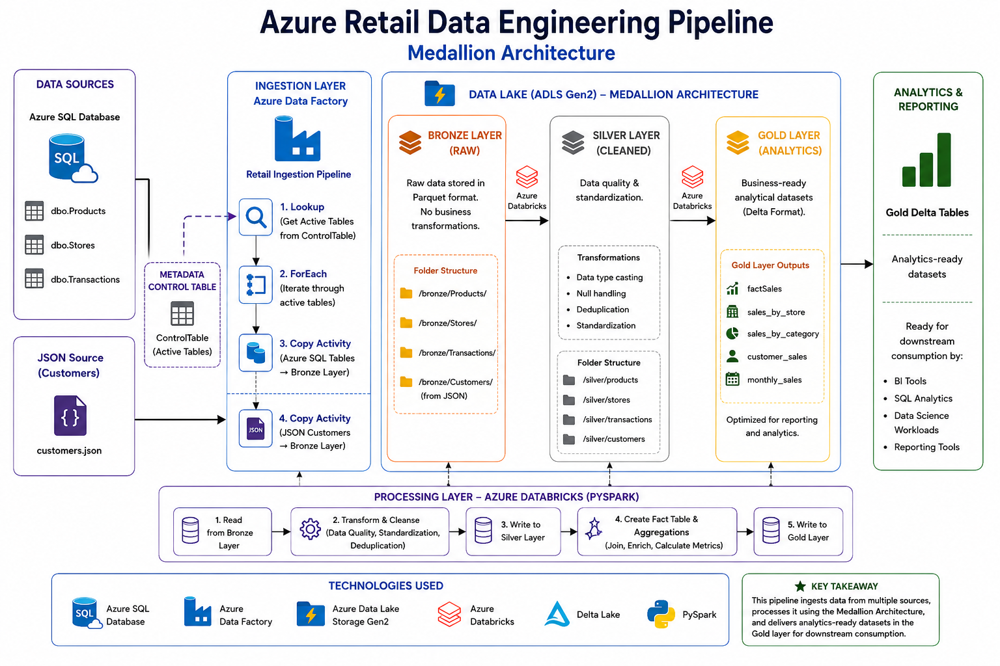

---

## Solution Workflow

```
Azure SQL Database + JSON
            │
            ▼
Azure Data Factory
(Lookup → ForEach → Copy)
            │
            ▼
Azure Data Lake Storage Gen2
       Bronze Layer
            │
            ▼
Azure Databricks
(Bronze → Silver)
            │
            ▼
Silver Delta Tables
            │
            ▼
Azure Databricks
(Silver → Gold)
            │
            ▼
Gold Analytics Tables
```

---

# Business Scenario

A retail company collects customer, product, store, and transaction data from multiple source systems. The objective is to centralize the data, improve data quality, and transform it into business-ready datasets for downstream analytics using the Medallion Architecture.

---

# Technology Stack

| Technology | Purpose |
|------------|---------|
| Azure SQL Database | Source system |
| JSON | Customer source |
| Azure Data Factory | Data ingestion & orchestration |
| Azure Data Lake Storage Gen2 | Bronze, Silver & Gold storage |
| Azure Databricks | Data transformation |
| PySpark | Data processing |
| Delta Lake | Optimized storage format |

---

# Pipeline Workflow

## 1. Source Systems

### Azure SQL Database

- Products
- Stores
- Transactions

### JSON

- Customers

---

## 2. Azure Data Factory

The ingestion pipeline is metadata-driven using a Control Table.

Pipeline activities:

- Lookup Activity
- ForEach Activity
- Parameterized Copy Activity
- Dynamic folder creation
- JSON file ingestion

This approach allows new source tables to be added without modifying the pipeline.

---

## 3. Bronze Layer

Raw source data is stored in ADLS Gen2 as Parquet files.

```
bronze/
│
├── Customers
├── Products
├── Stores
└── Transactions
```

No business transformations are applied in this layer.

---

## 4. Silver Layer

Azure Databricks performs data cleansing and standardization.

Transformations include:

- Data type casting
- Duplicate removal
- Null handling
- Text standardization
- Delta table creation

---

## 5. Gold Layer

Business-ready Delta tables are generated to support downstream reporting and analytics.

### Fact Table

- factSales

### Aggregate Tables

- sales_by_store
- sales_by_category
- customer_sales
- monthly_sales

These datasets are optimized for reporting and analytics.

---

# Repository Structure

```
azure-retail-data-engineering-pipeline/
│
├── README.md
│
├── adf/
│   └── RetailDataIngestionPipeline.json
│
├── architecture/
│   └── architecture_diagram.png
│
├── data/
│   └── customers.json
│
├── databricks/
│   ├── 01_configure_adls_connection.py
│   ├── 02_bronze_to_silver.py
│   └── 03_silver_to_gold.py
│
├── screenshots/
│   ├── 01_azure_sql_tables.png
│   ├── 02_control_table.png
│   ├── 03_adf_pipeline.png
│   ├── 04_dynamic_table_parameter.png
│   ├── 05_adf_pipeline_execution.png
│   ├── 06_adls_bronze.png
│   ├── 07_databricks_bronze.png
│   ├── 08_silver_delta_table.png
│   ├── 09_databricks_silver.png
│   └── 10_gold_table.png
│
├── sql/
│   ├── 01_create_tables.sql
│   ├── 02_load_sample_data.sql
│   ├── 03_create_control_table.sql
│   └── 04_seed_control_table.sql
│
└── .gitignore
```

---

# Databricks Notebooks

### 01_configure_adls_connection.py

- Configures Azure AD authentication
- Connects Azure Databricks to ADLS Gen2

### 02_bronze_to_silver.py

- Reads Bronze layer data from ADLS Gen2
- Performs data cleansing and standardization
- Writes Delta tables to the Silver layer

### 03_silver_to_gold.py

- Reads Silver Delta tables
- Creates the Fact Sales table
- Generates Gold aggregate tables for analytics

---

# Project Screenshots

### 1. Azure SQL Source Tables

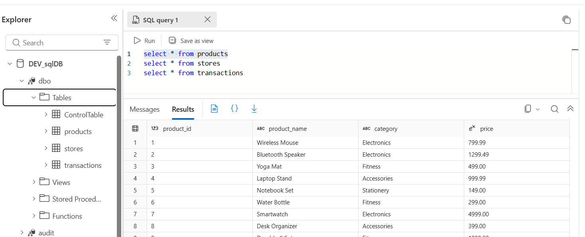

---

### 2. Control Table

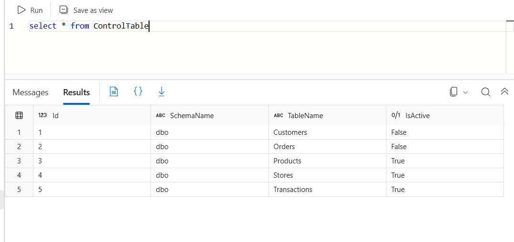

---

### 3. Azure Data Factory Pipeline

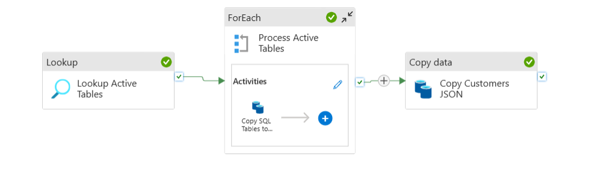

---

### 4. Dynamic Table Parameter

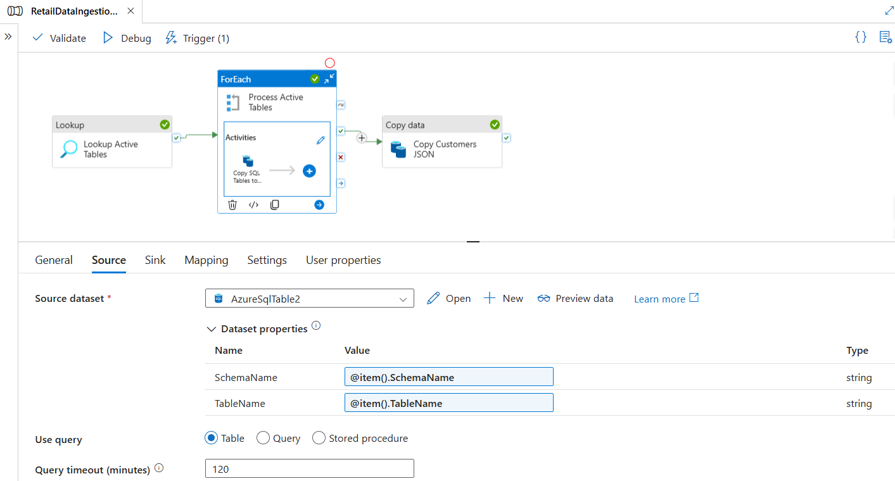

---

### 5. Pipeline Execution

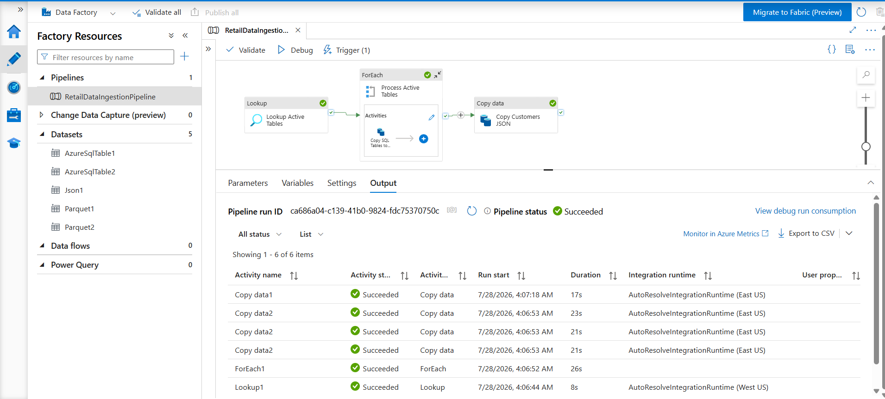

---

### 6. Bronze Layer (ADLS Gen2)

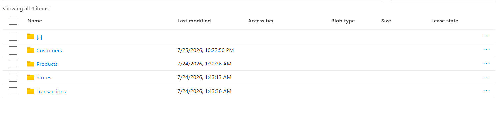

---

### 7. Bronze to Silver Transformation

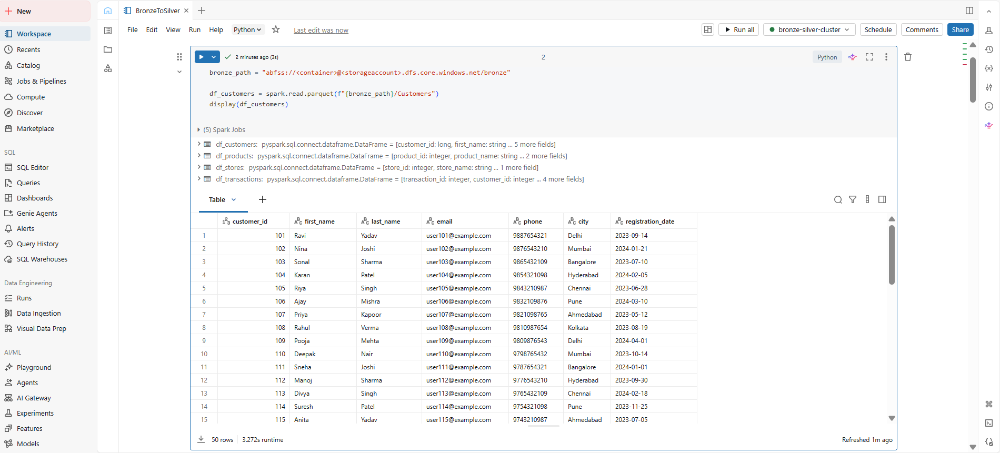

---

### 8. Silver Delta Tables

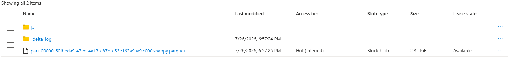

---

### 9. Silver to Gold Transformation

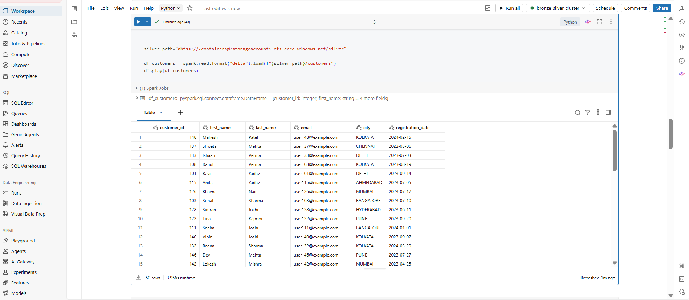

---

### 10. Gold Layer

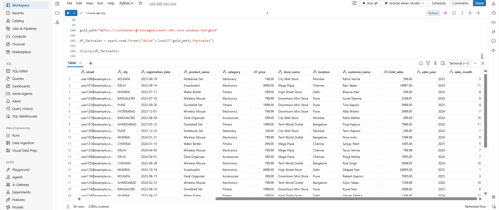

---

# How to Run

1. Create Azure SQL Database and load the sample data.
2. Upload the customer JSON file.
3. Deploy the Azure Data Factory pipeline.
4. Configure Azure Databricks authentication for ADLS Gen2.
5. Execute the Azure Data Factory pipeline.
6. Run the Databricks notebooks in sequence:
   - 01_configure_adls_connection.py
   - 02_bronze_to_silver.py
   - 03_silver_to_gold.py
7. Verify the generated Silver and Gold Delta tables.

---

# Skills Demonstrated

- Azure Data Factory
- Azure Data Lake Storage Gen2
- Azure Databricks
- PySpark
- Delta Lake
- Azure SQL Database
- ETL / ELT Pipeline Development
- Metadata-driven Ingestion
- Dynamic Pipeline Parameterization
- Medallion Architecture
- Data Transformation & Cleansing

---

## Author

**Darshana Jaiswal**

Built as part of my Azure Data Engineering portfolio.
